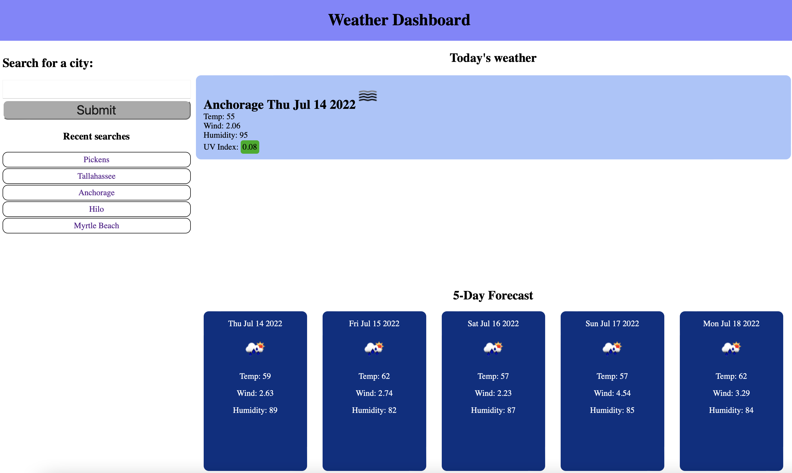

# WEATHER DASHBOARD
This is an app that uses the OpenWeatherAPI to search for and show the weather for an area for the day, as well as the 5-day forecast.

---
## USE

To use, just type a city name into the search bar and press enter.  The results will be displayed and the city will be saved to your search history (in local storage).  If you search another city, you can then click on one of your recent searches and get the same weather info again.

---

[Link to deployed application](https://aaronmikelkey.github.io/weather-dashboard/)

---

